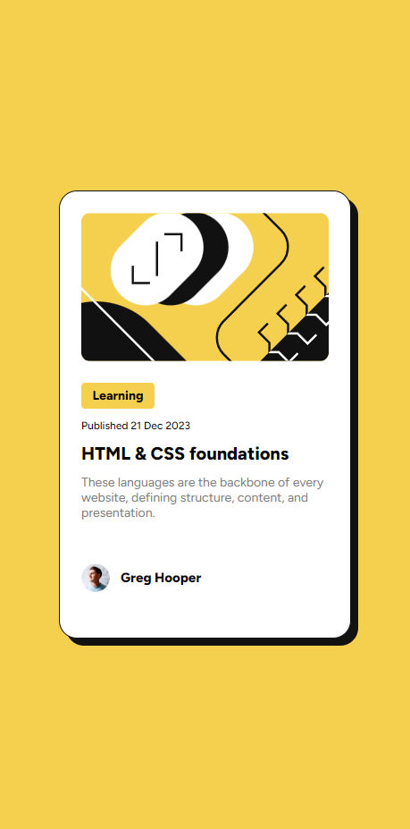

# Frontend Mentor - Blog preview card

Está é minha solução para o [Blog preview card challenge on Frontend Mentor](https://www.frontendmentor.io/challenges/blog-preview-card-ckPaj01IcS). Os desafios do Frontend Mentor ajudam você a melhorar suas habilidades de codificação através da construção de projetos realistas.

## Índice

- [Visão Geral](#overview)
  - [Screenshot](#screenshot)
  - [Links](#links)
- [Meu Processo](#meu-processo)
  - [Construído com](#construído-com)
  - [O que eu aprendi](#o-que-eu-aprendi)
- [Autor](#autor)

## Visão Geral

### Screenshot

#### Version Desktop

#### Version Mobile

### Links

- URL da solução: [Veja minha solução](https://github.com/bitsbygui/blog-preview-card-main-challenge-frontendmentor)
- Live Site URL: [Blog preview card solution](https://bitsbygui.github.io/blog-preview-card-main-challenge-frontendmentor/)

## Meu Processo

### Fluxo de trabalho

- **Passo 1:** Inicialize o diretório do projeto usando o Git
- **Passo 2:** Configure o repositório local para fazer push para o repositório remoto
- **Passo 3:** Examine o design do projeto e elabore um plano sobre como abordar o projeto
- **Passo 4:** Comece criando o layout usando apenas HTML
- **Passo 5:** Comece a adicionar estilos ao projeto. Os estilos serão adicionados na seguinte ordem, usando a abordagem de cima para baixo:
  - Estilo de conteúdo geral
  - Estilos seccionais
- **Passo 6:** Teste a completude do projeto em relação ao design.

### Construído com

- Marcação HTML5 semântica
- CSS
- Flexbox

## Autor

- Github - [bitsbygui](https://github.com/bitsbygui)
- Frontend Mentor - [@bitsbygui](https://www.frontendmentor.io/profile/bitsbygui)
